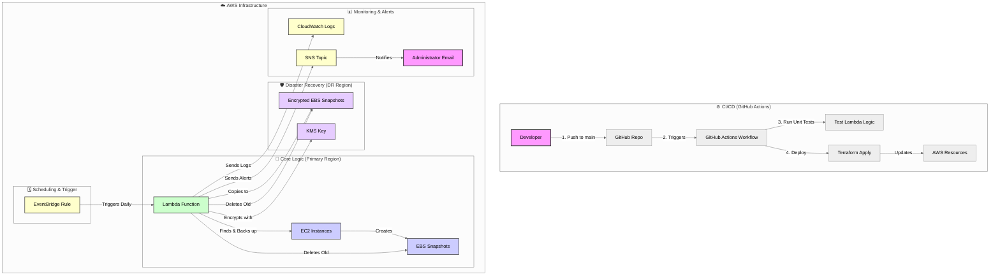

# Smart Vault: Automated AWS Backup & Disaster Recovery Framework

<p align="center" style="font-size: 18px;">
    Owned and Maintained by <a href="https://github.com/jujubear24">Jules Bahanyi</a>
</p>

This project is a complete, production-grade, serverless application built on Amazon Web Services (AWS) that provides a fully automated framework for backing up critical EC2 instances. It ensures business continuity through cross-region disaster recovery and optimizes costs through intelligent snapshot lifecycle management.

The entire infrastructure is managed as code using Terraform, and the architecture is designed to be event-driven, scalable, and secure.

## 1. The Business Problem & The Cloud Solution

This project was designed to solve four critical business challenges related to data protection and business continuity:

1. **Problem: Manual backups are inconsistent and error-prone.**

    * **Solution**: The entire backup process is **fully automated** using an **Amazon EventBridge** rule that triggers an **AWS Lambda** function on a daily schedule, eliminating human error and ensuring backups are never missed.

2. **Problem: A single-region failure can cause catastrophic data loss.**

    * **Solution**: The system provides robust **disaster recovery* by automatically copying every new snapshot to a secondary AWS region, ensuring a geographically isolated backup is always available.

3. **Problem: Backup storage costs can spiral out of control.**

    * **Solution**: An automated lifecycle policy is built into the Lambda function. It automatically deletes old snapshots in both the primary and DR regions after a configurable retention period, providing significant cost optimization.

4. **Problem: Backups lack robust security and are difficult to audit.**

    * **Solution**: All disaster recovery snapshots are **encrypted by default** using a dedicated **AWS KMS key** with a strict resource policy. All actions are logged in **AWS CloudTrail**, providing a complete, auditable history of all backup and cleanup operations.

## 2. Architectural Diagram

The system is built on a robust, event-driven, serverless architecture using core AWS services. The entire infrastructure is managed declaratively using Terraform (Infrastructure as Code).



## 3. Core Features

* **Serverless Architecture**: No servers to manage. The solution is composed of managed AWS services, leading to zero idle costs.

* **Event-Driven Automation**: The EventBridge trigger creates a hands-off, fully automated workflow.

* **Infrastructure as Code (IaC)**: The entire cloud environment is defined declaratively using Terraform, ensuring consistent and repeatable deployments.

* **Automated CI/CD**: A GitHub Actions workflow can automatically test and deploy infrastructure changes on every push to the main branch.

* **Unit Testing**: The core business logic in the Lambda function is validated by an automated unit testing suite using moto to mock AWS services.

* **Secure by Design**: Enforces encryption in the DR region with a dedicated KMS key and follows the principle of least privilege with fine-grained IAM roles.

* **Cost-Effective**: Pay-per-use services combined with automated snapshot cleanup ensures minimal operational cost.

* **Robust Error Handling & Alerting**: A CloudWatch alarm monitors for Lambda errors and sends an email notification via SNS if anomalies are detected.

## 4. Technology Stack

| Category | Technology |
|----------|------------|
|Infrastructure | Terraform, AWS|
| Compute |  AWS Lambda (Python) |
| Storage |  AWS S3 (for Terraform state), AWS EBS Snapshots |
| Security & Identity | AWS IAM, AWS KMS |
| CI/CD & Source Control | GitHub, GitHub Actions |
| Testing | Python, ``unittest``, ```moto``` |
| Monitoring & Alerting | AWS CloudWatch, AWS SNS |

## 5. Setup & Deployment

### Prerequisites

* [Terraform](https://developer.hashicorp.com/terraform/install) installed.

* [AWS CLI](https://docs.aws.amazon.com/cli/latest/userguide/getting-started-install.html) installed and configured with your AWS credentials.

* [Python](https://www.python.org/downloads/) installed.

### Infrastructure Deployment

1. **Clone the Repository**:

    ```bask

    git clone [https://github.com/](https://github.com/)<your-username>/aws-smart-vault.git

    cd aws-smart-vault
    ```

2. **Set Up Terraform Backend**:
    
    This project uses a remote S3 backend to securely store the Terraform state file.

    * Create a unique S3 bucket:

        ```bash
        aws s3api create-bucket --bucket <your-unique-bucket-name-for-tfstate> --region us-east-1
        ```

    * Update the backend configuration: Open the ```providers.tf``` file and replace the placeholder bucket name with the one you just created.

3. **Deploy the Infrastructure**:

    ```bash
    terraform init
    terraform apply
    ```

    Review the plan and type `yes` to confirm the deployment.

### Unit Testing

To run the automated tests for the Lambda function locally:

1. **Navigate to the Lambda Directory**:

    ```bash
    cd src/
    ```

2. **Install Test Dependencies (if not already installed)**:

    ```bash
    pip install boto3 moto
    ```

3. **Run the Tests**:

    ```bash
    python -m unittest discover tests
    ```

## 6. Project Structure

The repository is organized to separate infrastructure code from the application logic.

```
.
├── .github/workflows/          # (Optional) CI/CD workflow definitions
│   └── deploy.yml
├── src/
│   ├── lambda_function.py      # Core Python logic for the backup process
│   └── tests/                  # Unit tests for the Lambda function
│       └── test_lambda.py
├── dist/
│   └── lambda_function.zip     # Zipped code for deployment (created by Terraform)
├── main.tf                     # Main Terraform configuration for all AWS resources
├── providers.tf                # Terraform provider and backend configuration
├── variables.tf                # Input variables for Terraform
├── .gitignore
└── README.md
    
```

## 7. License
This project is licensed under the MIT License.
