# Smart Vault: Automated AWS Backup & Disaster Recovery Framework

<p align="center" style="font-size: 18px;">
    Owned and Maintained by <a href="https://github.com/jujubear24">Jules Bahanyi</a>
</p>

This project is a complete, production-grade, serverless framework for automated backups and disaster recovery built on Amazon Web Services (AWS). It solves the critical business problems of data loss and prolonged downtime by providing a fully automated, cost-effective, and secure solution for protecting and restoring critical EC2 instances.

The entire infrastructure is managed as code using ``Terraform``, with all application logic validated by a full suite of unit tests and a CI/CD pipeline using **GitHub Actions**.

## 1. The Business Problem & The Cloud Solution

This framework was designed to solve three fundamental challenges that businesses face in the cloud:

1. **Problem: Data Loss from Human Error or Failures.** Manual backup processes are unreliable and inconsistent. Forgetting to back up a critical server can lead to catastrophic data loss.

    * **Cloud Solution**: An **event-driven**, **serverless workflow** using **AWS Lambda** and **Amazon EventBridge** automatically discovers and backs up specifically tagged EC2 instances on a daily schedule, creating encrypted, cross-region EBS snapshots without any human intervention.

2. **Problem:  Slow, Complex, and Manual Recovery.** When a disaster strikes, manually provisioning new resources from backups is slow, error-prone, and dramatically increases downtime (RTO), costing the business money and customer trust.

    * **Cloud Solution**: A **secure, asynchronous REST API** built with **API Gateway** and two Lambda functions orchestrates the entire recovery process. A single API call can trigger a full restore, automatically launching a new EC2 instance and attaching the restored data volume, enabling rapid and reliable disaster recovery.

3. **Problem: Uncontrolled Costs.** Storing backups indefinitely or using inefficient methods leads to ever-increasing storage costs that are difficult to predict and manage.

    * **Cloud Solution**: The system implements an **automated lifecycle policy**, deleting snapshots older than a configurable retention period. A **CloudWatch Billing Alarm** provides a financial safety net by automatically sending an alert if estimated account charges exceed a predefined threshold.

## 2. Architectural Diagram

The system is built on a robust, event-driven, serverless architecture using core AWS services. The entire infrastructure is managed declaratively using Terraform (Infrastructure as Code).

```mermaid
---
config:
  theme: neutral
---
flowchart TD
    %% Define Subgraphs for organization
    subgraph "CI/CD Pipeline (GitHub Actions)"
        direction LR
        Dev["Developer 🧑‍💻"] -- "git push" --> GitHub["GitHub Repo"]
        GitHub -- "Triggers" --> Workflow["CI Workflow"]
        Workflow -- "Runs" --> Tests["Unit Tests"]
    end

    subgraph "Automated Backup Workflow (Daily)"
        direction LR
        A["EventBridge <br> (Scheduler)"] -- "Triggers" --> B["Backup Lambda"]
        B -- "Finds Instances by Tag" --> C["EC2 Instances <br> (tag: Backup-Tier=Gold)"]
        B -- "Creates & Copies" --> D["EBS Snapshots <br> (Primary Region)"]
        D -- "Copied to" --> E["EBS Snapshots <br> (DR Region)"]
        B -- "Sends Notification" --> F["SNS Topic"]
    end
    
    subgraph "Asynchronous Restore Workflow (On-Demand)"
        direction LR
        G["User/Client 👨‍💼"] -- "1. POST /restore <br> (snapshot_id)" --> H["API Gateway <br> (with API Key)"]
        H -- "2. Invokes Synchronously" --> I["API Handler Lambda <br> (Fast Validator)"]
        I -- "3. Returns '202 Accepted'" --> G
        I -- "4. Invokes Asynchronously" --> J["Worker Lambda <br> (Long-Running Orchestrator)"]
        J -- "5. Creates Volume" --> K["New EBS Volume"]
        J -- "6. Launches Instance" --> L["New EC2 Instance"]
        J -- "7. Attaches Volume" --> L
        J -- "8. Sends Final Status" --> F
    end

    subgraph "Monitoring & Alerting"
         M["CloudWatch <br> (Billing Metrics)"] -- "Triggers on Threshold" --> N["Billing Alarm"]
         N -- "Sends Notification" --> F
         F -- "Emails" --> O["Administrator 📧"]
    end
    
    %% Style definitions
    style B fill:#FFC300,stroke:#333,stroke-width:2px
    style I fill:#FFC300,stroke:#333,stroke-width:2px
    style J fill:#FF5733,stroke:#333,stroke-width:2px
    style F fill:#C70039,stroke:#333,stroke-width:2px,color:#fff
    style H fill:#900C3F,stroke:#333,stroke-width:2px,color:#fff
    style N fill:#C70039,stroke:#333,stroke-width:2px,color:#fff
```



## 3. Core Features

* **Fully Automated Backups:** Serverless cron job creates daily, encrypted, cross-region snapshots of tagged EC2 instances.

* **Secure Restore API:** A REST API protected by an API key allows for on-demand disaster recovery.

* **Asynchronous Orchestration:** The restore process uses a two-part Lambda pattern to handle long-running tasks like launching an EC2 instance without timing out the API, reporting the final status via SNS.

* **Automated Lifecycle Management:** The backup Lambda automatically deletes snapshots older than a configurable retention period to control costs.

* **Infrastructure as Code (IaC):** The entire cloud environment is defined declaratively using Terraform, ensuring consistent and repeatable deployments.

* **Automated CI/CD:** A GitHub Actions workflow automatically runs the full unit test suite on every push to the main branch, ensuring code quality.

* **Comprehensive Unit Testing:** The core business logic in all Lambda functions is validated by an automated unit testing suite using ``unittest`` and ``moto``.

* **Cost Control:** A CloudWatch Billing Alarm provides proactive alerts if estimated monthly costs exceed a set threshold.

* **Enhanced Observability:** AWS X-Ray is enabled on all Lambda functions for end-to-end distributed tracing and performance analysis.

## 4. Technology Stack

| Category | Technology |
|----------|------------|
|Infrastructure | Terraform|
| Compute |  AWS Lambda (Python 3.12) |
| Storage |  AWS S3 (for Terraform state), AWS EBS Snapshots |
| API | Amazon API Gateway (REST API w/ API Key) |
| Scheduling & Events | Amazon EventBridge |
| CI/CD & Source Control | GitHub, GitHub Actions |
| Testing | Python, ``unittest``, ```moto```, ``freezegun`` |
| Security & Identity | AWS IAM, AWS KMS (Key Management Service)|
| Monitoring & Alerting | AWS CloudWatch, AWS SNS, AWS X-Ray |

## 5. Setup & Deployment

### Prerequisites

* [Terraform](https://developer.hashicorp.com/terraform/install) installed.

* [AWS CLI](https://docs.aws.amazon.com/cli/latest/userguide/getting-started-install.html) installed and configured with your AWS credentials.

* [Python 3.12+](https://www.python.org/downloads/) installed.

### Infrastructure Deployment

1. **Clone the Repository**:

    ```bask

    git clone [https://github.com/](https://github.com/)<your-username>/aws-smart-vault.git

    cd aws-smart-vault
    ```

2. **Set Up Terraform Backend**:
    
    This project uses a remote S3 backend to securely store the Terraform state file.

    * Create a unique S3 bucket:

        ```bash
        aws s3api create-bucket --bucket <your-unique-bucket-name-for-tfstate> --region us-east-1
        ```

    * Update the backend configuration: Open the ```providers.tf``` file and replace the placeholder bucket name with the one you just created.

3. **Deploy the Infrastructure**:

    ```bash
    terraform init
    terraform apply
    ```

    Review the plan and type `yes` to confirm the deployment.

### Testing the Restore API

After deployment, Terraform will output the API URL and a sensitive API key.

1. Get Outputs:

    ```bash
    API_URL="$(terraform output -raw restore_api_invoke_url)/restore"

    API_KEY="$(terraform output -raw api_key_value)"
    ```

2. Find Resources: Get a valid ``SNAPSHOT_ID``, ``AMI_ID``, and ``SUBNET_ID`` from your AWS account (us-east-1).

3. Run ``curl`` Test:

    ```bash

    # (Replace placeholder values)
    SNAPSHOT_ID="snap-..."
    AMI_ID="ami-..."
    SUBNET_ID="subnet-..."

    curl -X POST \
    -H "Content-Type: application/json" \
    -H "x-api-key: ${API_KEY}" \
    -d '{
            "snapshot_id": "'"${SNAPSHOT_ID}"'",
            "launch_instance": true,
            "ami_id": "'"${AMI_ID}"'",
            "subnet_id": "'"${SUBNET_ID}"'"
        }' \
    "${API_URL}"
    ```
    You should receive a 202' Accepted response. A few minutes later, an SNS email will confirm the final result.

## 6. Unit Testing

To run the automated tests for the Lambda function locally:

1. **Navigate to the Lambda Directory**:

    ```bash
    cd src/
    ```

2. **Install Test Dependencies (if not already installed)**:

    ```bash
    pip install -r tests/requirements.txt
    ```

3. **Run the Tests**:

    ```bash
    python -m unittest discover tests
    ```

## 7. Project Structure

The repository is organized to separate infrastructure code from the application logic.

```
.
├── .github/workflows/
│   └── run-tests.yml        # CI/CD workflow for unit tests
├── src/
│   ├── lambda_function.py   # --- Backup Lambda ---
│   ├── restore_api_handler/
│   │   └── handler.py       # --- Restore API Handler Lambda ---
│   ├── restore_handler/
│   │   └── restore_function.py  # --- Restore Worker Lambda ---
│   └── tests/
│       ├── requirements.txt
│       ├── test_lambda.py   # Tests for Backup Lambda
│       └── test_restore_function.py # Tests for Restore Lambdas
├── main.tf                  # Main Terraform configuration
├── variables.tf             # Terraform input variables
├── providers.tf             # Terraform provider setup
└── README.md

    
```

## 8. License
This project is licensed under the MIT License.
